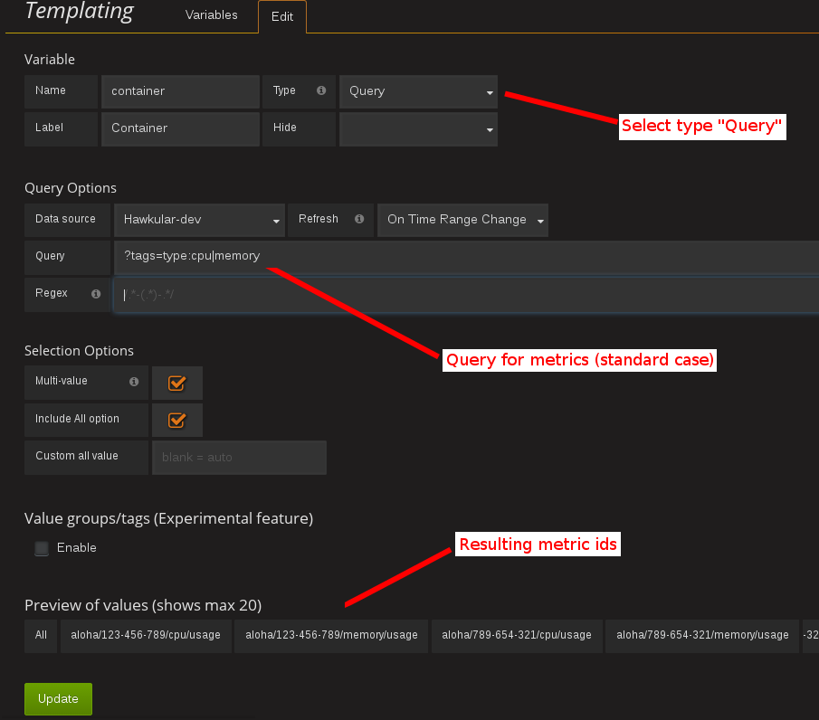
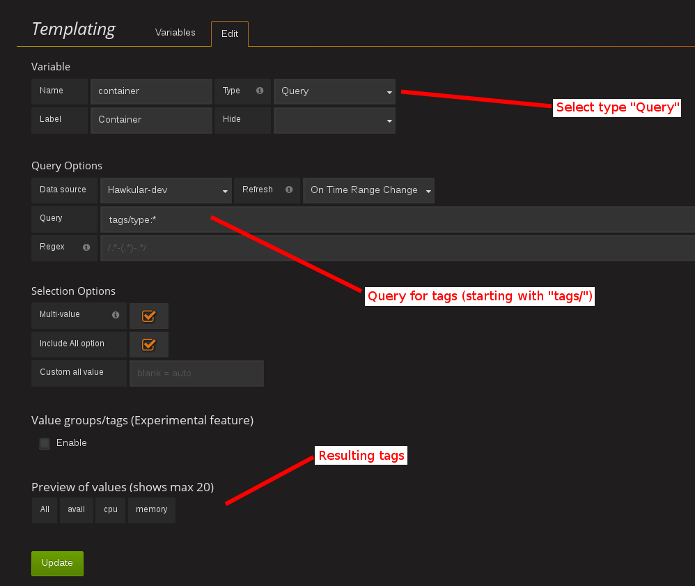

# Hawkular Datasource for Grafana

This project is the Hawkular Datasource plugin for Grafana 3. It works with:

* Metrics standalone servers as well
* Hawkular servers, starting from version Alpha13

## Installing

NOTE: If you don't have Grafana yet, [download and install it](http://grafana.org/download/).

### From source

Download the source code and copy the content of `dist` to `hawkular` inside Grafana's plugin directory.

```bash
# This is the default for Linux Grafana installs. Change it to match yours, if needed.
GRAFANA_PLUGINS=/var/lib/grafana/plugins
wget https://github.com/hawkular/hawkular-grafana-datasource/archive/release.zip -O hawkular-grafana-datasource-release.zip
unzip hawkular-grafana-datasource-release.zip
mkdir ${GRAFANA_PLUGINS}/hawkular
cp -R hawkular-grafana-datasource-release/dist/* ${GRAFANA_PLUGINS}/hawkular
```

### From the Grafana plugin directory

COMING SOON

## Configuration

The datasource URL must point to the Hawkular Metrics service, e.g. `http://myhost:8080/hawkular/metrics`

`direct` access mode only works with standalone Metrics servers currently. If you active it, make sure to allow
the Grafana server origin in Metrics' configuration.

Authentication must be set when working with a Hawkular server. Check the 'Basic Auth' box and fill the user and password fields.

Select the tenant. On Hawkular servers, use `hawkular`.

Openshift-Metrics users must provide an authentication token.

## Using Grafana Templating (variables)

Grafana allows you to create dashboard templates through the definition of variables. 
This is [documented on Grafana's site](http://docs.grafana.org/reference/templating/).
With the Hawkular Datasource Plugin, the variables of type _'Query'_ are mapped to 
the [_@get (url)/metrics_](http://www.hawkular.org/docs/rest/rest-metrics.html#GET__metrics)
Hawkular Metrics endpoint and can be used to retrieve tenant's metric names. Use the _Query Options_ text field to pass query parameters, as illustrated below:

Example of query by tags to get metric ids


[TIP]
For instance, if you have metrics tagged _"type:memory"_ and others tagged _"type:cpu"_, you can write _"?tags=type:memory"_ to get only the _"memory"_ ones, or _"?tags=type:cpu|memory"_ to get them both. The leading question mark is not mandatory.

There is an exception to that rule: if the query string is prefixed with _'tags/'_, the variable will contain the matching
tag names rather than the metric names. In this case, the Hawkular Metrics endpoint [_@get (url)/metrics/tags/{tags}_](http://www.hawkular.org/docs/rest/rest-metrics.html#GET__metrics_tags__tags) will be used.

Example of query to get matching tag values


[TIP]
For instance, type _"tags/type:*"_ to get all of the available tag values for _"type"_.

Once you have set some variables, you can use them in graph queries: either for row or graph duplication, or to display multiple series in a single graph from a single query. This is especially useful when metric names contain some dynamic parts and thus cannot be known in advance.

## Building

You need `npm` and `grunt` to build the project. Clone this repository, then from that directory run:

```bash
npm install
grunt
```

Files are generated under the `dist` directory.
To test your build, copy these files to `${GRAFANA_PLUGINS}/hawkular` and restart grafana-server.

## Building and running a Docker image

```bash
# This will build the image
docker build -t hawkular/hawkular-grafana-datasource .
# This will run the image on http://localhost:3000/
docker run -i -p 3000:3000 --name hawkular-grafana-datasource --rm hawkular/hawkular-grafana-datasource
```
